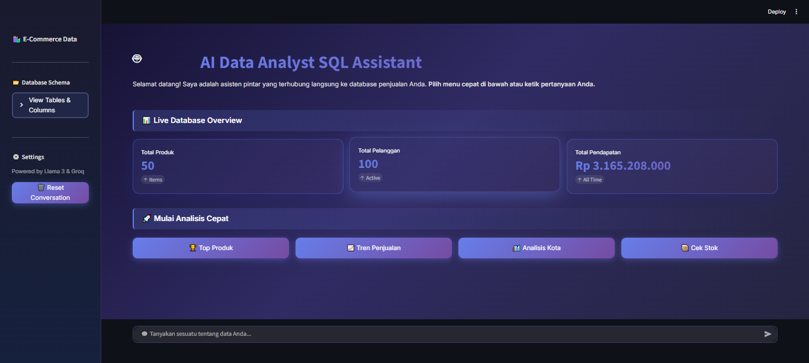
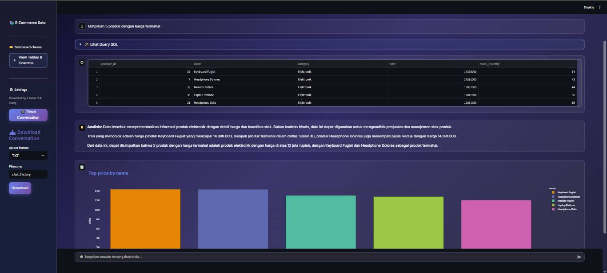

## 1. SETUP THE ENVIRONMENT:

    python -m venv myenv
    venv/scripts/activate

## 2. Install Packages :

pip install -r requirements.txt

# 🛒 E-Commerce AI Analyst

**E-Commerce AI Analyst** adalah asisten cerdas berbasis Artificial Intelligence yang memungkinkan pengguna melakukan analisis data penjualan menggunakan bahasa alami (Natural Language).

Aplikasi ini mengubah pertanyaan teks (seperti *"Tampilkan 5 produk terlaris"*) menjadi query SQL secara otomatis, mengeksekusinya ke database, dan menyajikan hasilnya dalam bentuk Tabel Interaktif, Narasi Insight, dan Visualisasi Grafik Otomatis.



---

## 🚀 Fitur Utama

1.  **Text-to-SQL Engine:** Menggunakan **Llama 3 (via Groq)** untuk menerjemahkan bahasa manusia menjadi query SQLite yang kompleks (JOIN, GROUP BY, Aggregation).
2.  **Smart Visualization:** Otomatis mendeteksi grafik yang cocok (Bar, Line, Pie) menggunakan **Plotly Interactive**.
3.  **Auto Insight:** Memberikan analisis naratif singkat tentang tren data yang ditemukan.
4.  **Persistent Memory:** Riwayat percakapan tersimpan otomatis (tidak hilang saat di-refresh).
5.  **Smart Limitations:** Memahami konteks "Seluruh" vs "Top 10" data.
6.  **Modern UI/UX:** Tampilan Dark Mode futuristik dengan Streamlit.

---

## 🛠️ Teknologi yang Digunakan

* **Bahasa:** Python 3.10+
* **Framework:** [Streamlit](https://streamlit.io/)
* **LLM Engine:** Llama 3-70b (via [Groq Cloud](https://groq.com/))
* **Orchestration:** LangChain
* **Database:** SQLite
* **Visualization:** Plotly Express
* **Data Manipulation:** Pandas

---
## 🛡️ Keamanan (Security)

**Read-Only Mode**  
Koneksi ke database dibatasi **hanya untuk operasi membaca (SELECT)**. Seluruh perintah manipulasi data seperti **DROP, DELETE, UPDATE, atau INSERT** akan **diblokir otomatis** oleh sistem untuk mencegah kerusakan maupun kehilangan data.

**Sanitasi Query**  
Sebelum dieksekusi, setiap query akan melalui proses **pengecekan keyword berbahaya** untuk meminimalkan risiko SQL Injection atau perintah destruktif tersembunyi.

---

## ⚠️ Batasan Sistem (Limitations)

Meskipun aplikasi ini dirancang untuk memudahkan analisis data, terdapat beberapa batasan teknis yang perlu dipahami:

### 1. Kompleksitas Logika SQL (*Reasoning Cap*)
Sistem menggunakan **LLM** untuk mengonstruksi query SQL.  
Meskipun sangat akurat untuk kueri standar, model dapat mengalami:
- *Hallucination* (kesalahan logika),
- Ketidaktepatan interpretasi,
pada instruksi yang **sangat kompleks**, **ambigu**, atau melibatkan **nested sub-queries** yang dalam.

### 2. Tidak Ada Analisis Prediktif (*No Machine Learning*)
Sistem ini difokuskan pada **Descriptive Analytics**, yaitu:
- Menjelaskan **apa yang telah terjadi** berdasarkan data historis di SQL.

Sistem **tidak** melakukan:
- **Predictive Analytics** (peramalan masa depan),
- **Analisis statistik lanjutan** seperti Regresi, Klasifikasi, atau Clustering  
yang memerlukan algoritma **Machine Learning**.

### 3. Kapasitas Memori Visualisasi
Hasil query diproses menggunakan **Pandas di memori (RAM)**.  
Jika pengguna menjalankan query dengan output sangat besar (misalnya **jutaan baris tanpa LIMIT**), aplikasi berpotensi mengalami:
- **Latency tinggi**,
- **Memory overload**,
saat proses visualisasi grafik.

### 4. Konteks Percakapan (*Context Window*)
LLM memiliki keterbatasan **memori jangka pendek (context window)**.  
Jika percakapan berlangsung terlalu panjang dalam satu sesi, model dapat:
- Melupakan sebagian instruksi awal,
- Kehilangan detail konteks yang spesifik.

➡️ Disarankan untuk merangkum ulang konteks penting atau memulai sesi baru untuk analisis lanjutan yang kompleks.

## 📂 Struktur Proyek

```text
E-COMMERCE-AI/
├── ecommerce.db            # Database SQLite (Sample Data)
├── nl2sql.py               # Main Application File (Run this!)
├── .env                    # Environment Variables (API Keys)
├── requirements.txt        # Daftar library Python
├── history_sql.pkl         # Cache history chat (Auto-generated)
└── module/                 # Folder Modular System
    ├── __init__.py
    ├── config.py           # Konfigurasi API & Model
    ├── download_utils.py   # Fitur download chat history
    ├── history_utils.py    # Sistem penyimpanan history (Pickle)
    ├── query_engine.py     # Logic Prompt Engineering (LangChain)
    └── sql_utils.py        # Eksekusi SQL & Keamanan Database

